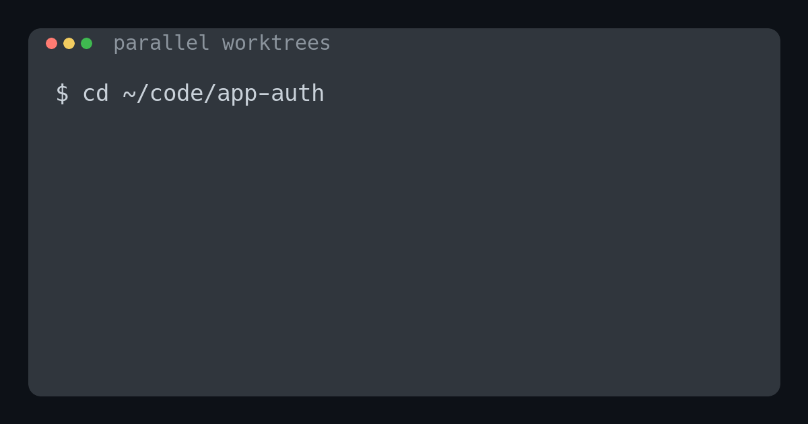

# port-selector

[](https://github.com/dapi/port-selector/actions/workflows/ci.yml)
[](https://github.com/dapi/port-selector/actions/workflows/release.yml)
[](https://goreportcard.com/report/github.com/dapi/port-selector)
[](https://github.com/dapi/port-selector)

[🇬🇧 English version](README.md)

**Стабильный свободный порт для каждого локального проекта, git worktree или сервиса — без захардкоженных чисел и `EADDRINUSE`.**

```bash
brew tap dapi/tap && brew install port-selector
PORT="$(port-selector)"; npm run dev -- --port "$PORT"
```

<p align="center">
  
</p>

## Мотивация

При разработке с использованием AI-агентов (Claude Code, Cursor, Copilot Workspace и др.) часто возникает ситуация, когда множество параллельных агентов работают над задачами в отдельных git worktree. Каждый агент может запускать веб-серверы для e2e-тестирования, и всем им нужны свободные порты.

**Проблема:** Когда 5-10 агентов одновременно пытаются запустить dev-серверы на порту 3000, возникают конфликты.

**Решение:** `port-selector` автоматически находит и выдаёт первый свободный порт из настроенного диапазона.

Выделение стабильно для пары `(каталог, имя)`, защищено от одновременной записи в реестр на Unix и может повторно использоваться другой shell-командой, browser-тестом или новой сессией агента. Именованные allocations дают одному проекту отдельные порты `web`, `api` и `db`.

```
┌─────────────────────────────────────────────────────────────┐
│  Agent 1 (worktree: feature-auth)                           │
│  $ PORT=$(port-selector) && npm run dev -- --port $PORT     │
│  → Server running on http://localhost:3000                  │
├─────────────────────────────────────────────────────────────┤
│  Agent 2 (worktree: feature-dashboard)                      │
│  $ PORT=$(port-selector) && npm run dev -- --port $PORT     │
│  → Server running on http://localhost:3001                  │
├─────────────────────────────────────────────────────────────┤
│  Agent 3 (worktree: bugfix-login)                           │
│  $ PORT=$(port-selector) && npm run dev -- --port $PORT     │
│  → Server running on http://localhost:3002                  │
└─────────────────────────────────────────────────────────────┘
```

## Дополнительные материалы

Практика запуска нескольких AI-агентов параллельно с использованием git worktrees становится всё более популярной. Каждый worktree обеспечивает полную изоляцию файлов, но все агенты по-прежнему используют общие сетевые ресурсы — включая порты. Когда агенты запускают dev-серверы, e2e-тесты или preview-деплойменты, конфликты портов неизбежны.

`port-selector` решает эту проблему, обеспечивая автоматическое выделение портов с периодом заморозки — каждый агент получает уникальный порт, даже если несколько агентов стартуют одновременно.

**Статьи о параллельной разработке с AI-агентами:**

- [How we're shipping faster with Claude Code and Git Worktrees](https://incident.io/blog/shipping-faster-with-claude-code-and-git-worktrees) — опыт incident.io с несколькими сессиями Claude Code и кастомным менеджером worktree
- [Parallel AI Development with Git Worktrees](https://sgryt.com/posts/git-worktree-parallel-ai-development/) — «три столпа»: изоляция состояния, параллельное выполнение, асинхронная интеграция
- [How Git Worktrees Changed My AI Agent Workflow](https://nx.dev/blog/git-worktrees-ai-agents) — практические сценарии, когда агенты работают в фоне, пока вы продолжаете кодить
- [Git Worktrees: The Secret Weapon for Running Multiple AI Agents](https://medium.com/@mabd.dev/git-worktrees-the-secret-weapon-for-running-multiple-ai-coding-agents-in-parallel-e9046451eb96) — почему worktrees стали необходимы в эпоху AI-разработки
- [Parallel Coding Agents with Container Use and Git Worktree](https://www.youtube.com/watch?v=z1osqcNQRvw) — видео-обзор трёх workflow для параллельных агентов

## Установка

### Homebrew

```bash
brew tap dapi/tap
brew install port-selector
```

Обновление:

```bash
brew upgrade port-selector
```

### One-liner (с учётом твоей главной ветки **master**)

```bash
curl -fsSL https://raw.githubusercontent.com/dapi/port-selector/master/install.sh | sh
```

#### Частые варианты

В /usr/local/bin:

```bash
curl -fsSL https://raw.githubusercontent.com/dapi/port-selector/master/install.sh | INSTALL_DIR=/usr/local/bin sh
```

Pin версии:

```bash
curl -fsSL https://raw.githubusercontent.com/dapi/port-selector/master/install.sh | VERSION=v0.8.0 sh
```

### Из релизов GitHub

```bash
# Linux (amd64)
curl -L https://github.com/dapi/port-selector/releases/latest/download/port-selector-linux-amd64 -o port-selector
chmod +x port-selector
sudo mv port-selector /usr/local/bin/

# macOS (arm64 - Apple Silicon)
curl -L https://github.com/dapi/port-selector/releases/latest/download/port-selector-darwin-arm64 -o port-selector
chmod +x port-selector
sudo mv port-selector /usr/local/bin/

# macOS (amd64 - Intel)
curl -L https://github.com/dapi/port-selector/releases/latest/download/port-selector-darwin-amd64 -o port-selector
chmod +x port-selector
sudo mv port-selector /usr/local/bin/
```

### Сборка из исходников

```bash
git clone https://github.com/dapi/port-selector.git
cd port-selector
make install
```

Это соберёт бинарник и установит его в `/usr/local/bin/`.

## Использование

### Базовое использование

```bash
# Получить свободный порт
port-selector
# Вывод: 3000

# Использовать в скрипте
PORT=$(port-selector)
npm run dev -- --port $PORT

# Или в одну строку
npm run dev -- --port $(port-selector)
```

### Примеры интеграции

#### Next.js / Vite / любой dev-сервер

```bash
# package.json scripts
{
  "scripts": {
    "dev": "PORT=$(port-selector) next dev -p $PORT",
    "dev:vite": "vite --port $(port-selector)"
  }
}
```

#### Docker Compose

```bash
# В .env или при запуске
export APP_PORT=$(port-selector)
docker-compose up
```

#### Playwright / e2e тесты

```bash
# В конфиге playwright
export BASE_URL="http://localhost:$(port-selector)"
npx playwright test
```

#### direnv (.envrc)

Идеальный способ для проектов с git worktree — порт назначается автоматически при входе в директорию:

```bash
# .envrc
export PORT=$(port-selector)

# Теперь в любом скрипте проекта используйте $PORT
# npm run dev автоматически получит свой уникальный порт
```

```bash
# Пример workflow с git worktree
$ cd ~/projects/myapp-feature-auth
direnv: loading .envrc
direnv: export +PORT

$ echo $PORT
3000

$ cd ~/projects/myapp-feature-dashboard
direnv: loading .envrc
direnv: export +PORT

$ echo $PORT
3001
```

#### Claude Code / AI агенты

Добавьте в CLAUDE.md вашего проекта:

```markdown
## Запуск dev-сервера

Перед запуском dev-сервера всегда используй port-selector:
\`\`\`bash
PORT=$(port-selector) npm run dev -- --port $PORT
\`\`\`
```

### Привязка порта к директории

Каждая директория автоматически получает свой выделенный порт. Запуск `port-selector` из одной директории всегда возвращает один и тот же порт:

```bash
$ cd ~/projects/project-a
$ port-selector
3000

$ cd ~/projects/project-b
$ port-selector
3001

$ cd ~/projects/project-a
$ port-selector
3000  # Тот же порт!
```

Особенно полезно с git worktree — каждый worktree получает стабильный порт.

### Именованные аллокации

Одна директория может иметь несколько именованных аллокаций для разных сервисов (web, api, database и т.д.):

```bash
# Распределить порты для разных сервисов в одной директории
$ port-selector --name web
3010

$ port-selector --name api  
3011

$ port-selector --name db
3012

# Список показывает колонку NAME
$ port-selector --list
PORT  DIRECTORY         NAME   SOURCE  STATUS  LOCKED  USER  PID  PROCESS  ASSIGNED
3010  ~/myproject       web    free    free    -       -     -    -        2026-01-06 20:00
3011  ~/myproject       api    free    free    -       -     -    -        2026-01-06 20:01
3012  ~/myproject       db     free    free    -       -     -    -        2026-01-06 20:02
```

Имя по умолчанию — `main`, используется когда `--name` не указан:

```bash
$ port-selector                    # Использует имя "main"
$ port-selector --name main        # То же самое
```

Именованные аллокации полезны для:
- Микросервисов в монорепозитории, которым нужны разные порты
- Запуска нескольких сервисов из одной директории
- Разделения портов web, API и базы данных для одного проекта

### Управление аллокациями

```bash
# Показать все аллокации портов
port-selector --list

# Вывод:
PORT  DIRECTORY                 NAME  SOURCE  STATUS  LOCKED  USER  PID  PROCESS  ASSIGNED
3000  ~/code/merchantly/main    main  lock    free    yes     -     -    -        2026-01-03 20:53
3001  ~/code/valera             main  free    free    yes     -     -    -        2026-01-03 21:08
3010  ~/myproject               web   free    free    -       -     -    -        2026-01-06 20:00
3011  ~/myproject               api   free    free    -       -     -    -        2026-01-06 20:01
3500  ~/other-project           main  external busy   -       user  1234 python   2026-01-10 15:30
#
# Совет: Запустите с sudo для полной информации о процессах: sudo port-selector --list

# Удалить все аллокации для текущей директории
cd ~/projects/old-project
port-selector --forget
# Cleared 2 allocation(s) for /home/user/projects/old-project (most recent was port 3005)

# Удалить конкретную именованную аллокацию
port-selector --forget --name web
# Cleared allocation 'web' for /home/user/projects/old-project (was port 3010)

# Удалить все аллокации
port-selector --forget-all
# Cleared 5 allocation(s)

# Обновить внешние аллокации (удалить устаревшие)
port-selector --refresh
# Refreshing 3 external allocation(s)...
# Removed 2 stale external allocation(s).
```

Колонка **SOURCE** показывает источник аллокации:
- `free` — обычная аллокация, порт сейчас свободен
- `lock` — порт заблокирован за этой директорией
- `external` — порт используется другой директорией/процессом

Внешние аллокации создаются автоматически, когда вы пытаетесь заблокировать порт, который уже занят другой директорией/процессом. Это предотвращает конфликты при выделении портов, отслеживая занятые порты.

### Блокировка портов

Заблокируйте порт, чтобы он не мог быть выделен другим директориям. Полезно для долгоживущих сервисов, которым нужно сохранять свой порт даже при перезапуске:

```bash
# Заблокировать порт для текущей директории (использует имя "main")
cd ~/projects/my-service
port-selector --lock
# Locked port 3000 for 'main'

# Заблокировать именованную аллокацию
port-selector --lock --name web
# Locked port 3010 for 'web'

# Заблокировать конкретный порт (выделяет И блокирует за один шаг)
cd ~/projects/new-service
port-selector --lock 3005
# Locked port 3005 for 'main'

# Если порт занят другой директорией, он регистрируется как external
cd ~/projects/another-project
port-selector --lock 3005
# Port 3005 is externally used by python, registered as external

# Разблокировать порт для текущей директории
port-selector --unlock
# Unlocked port 3000 for 'main'

# Разблокировать именованную аллокацию
port-selector --unlock --name web
# Unlocked port 3010 for 'web'

# Разблокировать конкретный порт
port-selector --unlock 3005
# Unlocked port 3005
```

При использовании `--lock <PORT>` с конкретным номером порта:
- Если порт не выделен, он будет выделен текущей директории И заблокирован
- Если порт занят той же директорией, он будет помечен как заблокированный
- Если порт занят другой директорией, он будет зарегистрирован как **external** аллокация
- Это предотвращает конфликты, отслеживая все занятые порты
- Это удобно, когда вы хотите конкретный порт для нового проекта
- Порт должен находиться в настроенном диапазоне

Умная логика `--force`, когда порт принадлежит другой директории:
- **Свободен + разблокирован**: переназначается без `--force` (заброшенная аллокация)
- **Свободен + заблокирован**: требуется `--force`
- **Занят (любой)**: блокируется полностью — сначала остановите сервис

При блокировке занятого порта без аллокации:
- Требуется `--force` (вы берёте ответственность за конфликт)

```bash
# Порт заблокирован другой директорией - нужен --force:
port-selector --lock 3006
# error: port 3006 is locked by ~/code/other-project
#        use --lock 3006 --force to reassign it to current directory

# Принудительное переназначение заблокированного порта:
port-selector --lock 3006 --force
# warning: port 3006 was allocated to ~/code/other-project
# Reassigned and locked port 3006 for 'main' in ~/current-project

# Порт занят другой директорией - переназначить нельзя:
port-selector --lock 3006 --force
# error: port 3006 is in use by ~/code/other-project; stop the service first
```

Когда порт заблокирован:
- Он остаётся закреплённым за своей директорией
- Другие директории не могут получить этот порт при выделении
- Владеющая директория может использовать порт как обычно

### Обнаружение существующих портов

При первом использовании `port-selector` в окружении, где часть портов уже занята, можно просканировать диапазон и записать их:

```bash
port-selector --scan
# Scanning ports 3000-3200...
# Port 3005: already allocated to ~/code/worktrees/feature/103-manager-reply
# Port 3014: already allocated to ~/code/valera
#
# No new ports to record.

# При обнаружении новых портов:
# Scanning ports 3000-3200...
# Port 3000: used by node (pid=12345, cwd=~/projects/app-a)
# Port 3007: used by docker-proxy (pid=585980, cwd=~/projects/my-compose-app)
#
# Recorded 2 port(s) to allocations.
#
# Совет: Запустите с sudo для полной информации о процессах: sudo port-selector --scan
```

Это создаёт аллокации для занятых портов, чтобы `port-selector` не пытался их выделить.

**Примечание:** Порты, занятые root-процессами (например, `docker-proxy`), могут не иметь доступной информации о процессе. Такие порты всё равно записываются с маркером `(unknown:PORT)` для предотвращения конфликтов при выделении.

#### Запуск через sudo

Чтобы видеть полную информацию о процессах (PID, имя процесса) для портов, принадлежащих другим пользователям, запускайте через sudo. **Важно:** используйте флаг `-E` для сохранения переменных окружения, иначе конфиг будет создан в `/root/.config/`:

```bash
# Неправильно: создаёт отдельный конфиг в /root/.config/port-selector/
sudo port-selector --scan

# Правильно: использует конфиг вашего пользователя
sudo -E port-selector --scan

# Альтернатива: явно передать HOME
sudo HOME=$HOME port-selector --scan
```

### Определение директории Docker-контейнеров

Когда порт публикуется через Docker, хост-процесс — `docker-proxy` с бесполезным `cwd=/`. `port-selector` автоматически определяет реальную директорию проекта:

```bash
port-selector --scan
# Port 3007: used by docker-proxy (pid=585980, cwd=/home/user/my-project)
#                                                  ↑ получено из контейнера
```

Для определения директории используется:
1. Лейбл `com.docker.compose.project.working_dir` (проекты docker-compose)
2. Источник bind mount (fallback для `docker run`)

**Примечание:** Требуется наличие CLI `docker`.

### Аргументы командной строки

```
port-selector [options]

Options:
  -h, --help           Показать справку
  -v, --version        Показать версию
  -l, --list           Показать все аллокации портов
  -c, --lock [PORT]    Заблокировать порт для текущей директории и имени (или указанный порт)
  -u, --unlock [PORT]  Разблокировать порт для текущей директории и имени (или указанный порт)
  --force, -f          Принудительно заблокировать занятый или чужой заблокированный порт
  --forget             Удалить все аллокации для текущей директории
  --forget --name NAME Удалить аллокацию с указанным именем для текущей директории
  --forget-all         Удалить все аллокации
  --scan               Просканировать порты и записать занятые с их директориями
  --refresh            Обновить внешние аллокации (удалить устаревшие)
  --name NAME          Использовать именованную аллокацию (по умолчанию: "main")
  --verbose            Включить debug-вывод (можно комбинировать с другими флагами)
```

### Debug-вывод

Используйте `--verbose` для просмотра подробной информации о процессе выбора порта:

```bash
port-selector --verbose
# [DEBUG] main: starting port selection
# [DEBUG] config: loading config from /home/user/.config/port-selector/config.yaml
# [DEBUG] config: loaded: portStart=3000, portEnd=4000, freezePeriod=1440, allocationTTL=30d
# [DEBUG] main: config loaded: portStart=3000, portEnd=4000, freezePeriod=1440 min
# [DEBUG] allocations: loading from /home/user/.config/port-selector/allocations.yaml
# [DEBUG] allocations: loaded 5 allocations
# [DEBUG] main: current directory: /home/user/projects/my-app
# [DEBUG] main: found existing allocation: port 3001
# [DEBUG] main: existing port 3001 is free, reusing
# 3001
```

Флаг `--verbose` можно комбинировать с другими:

```bash
port-selector --scan --verbose
port-selector --list --verbose
```

## Конфигурация

При первом запуске создаётся файл конфигурации:

**~/.config/port-selector/config.yaml**

```yaml
# Начальный порт диапазона
portStart: 3000

# Конечный порт диапазона
portEnd: 4000

# Период заморозки порта после выдачи
# Порт не будет переиспользован в течение этого времени
# Поддерживает: 24h (часы), 30m (минуты), 1d (дни)
# "0" = отключено, по умолчанию: 24h
freezePeriod: 24h

# Автоматическое удаление аллокаций после указанного периода
# Поддерживает: 30d (дни), 720h (часы), 24h30m (комбинированный формат)
# "0" = отключено (по умолчанию)
allocationTTL: 30d

# Путь к файлу логов для записи операций (опционально)
# Раскомментируйте для включения логирования всех изменений аллокаций
# log: ~/.config/port-selector/port-selector.log
```

### Логирование

Когда указан `log`, все изменения аллокаций записываются в указанный файл:

```yaml
log: ~/.config/port-selector/port-selector.log
```

Формат логов:
```
2026-01-03T15:04:05Z ALLOC_ADD port=3001 dir=/home/user/project1 process=node
2026-01-03T15:04:10Z ALLOC_LOCK port=3001 locked=true
2026-01-03T15:05:00Z ALLOC_DELETE port=3002 dir=/home/user/forgotten
```

Логируемые события:
- `ALLOC_ADD` — новый порт выделен
- `ALLOC_UPDATE` — обновлена временная метка аллокации (повторное использование)
- `ALLOC_LOCK` — порт заблокирован/разблокирован
- `ALLOC_DELETE` — аллокация удалена (--forget)
- `ALLOC_DELETE_ALL` — все аллокации удалены (--forget-all)
- `ALLOC_EXPIRE` — аллокация истекла по TTL
- `ALLOC_EXTERNAL` — зарегистрирована внешняя аллокация порта
- `ALLOC_REFRESH` — обновлены внешние аллокации

### TTL аллокаций

Когда `allocationTTL` установлен, аллокации старше указанного периода автоматически удаляются при каждом запуске. Это предотвращает накопление устаревших аллокаций от удалённых проектов:

```yaml
allocationTTL: 30d  # Аллокации истекают после 30 дней неактивности
```

Временная метка обновляется каждый раз, когда порт возвращается для существующей аллокации, поэтому активно используемые аллокации никогда не истекают.

### Период заморозки (Freeze Period)

После выдачи порта он "замораживается" на указанное время и не будет выдан повторно. Это решает проблему, когда приложение медленно стартует и порт кажется свободным, хотя на нём вот-вот запустится другой сервер.

```
Время 10:00 - Agent 1 запросил порт → получил 3000
Время 10:01 - Agent 2 запросил порт → получил 3001 (3000 заморожен)
Время 10:02 - Agent 1 остановился, порт 3000 освободился
Время 10:03 - Agent 3 запросил порт → получил 3002 (3000 всё ещё заморожен)
...
Время 34:01 - Прошло 24 часа, порт 3000 разморожен
```

Информация о заморозке портов хранится в `~/.config/port-selector/allocations.yaml` как часть временных меток аллокаций.

### Кеширование

Для оптимизации утилита запоминает последний выданный порт в `~/.config/port-selector/allocations.yaml` (поле `last_issued_port`). При следующем вызове проверка начинается с этого порта, а не с начала диапазона.

```
Первый вызов:  проверяет 3000 → свободен → возвращает 3000, сохраняет 3000
Второй вызов:  проверяет 3001 → свободен → возвращает 3001, сохраняет 3001
Третий вызов:  проверяет 3002 → занят → проверяет 3003 → свободен → возвращает 3003
...
После 4000:    проверяет 3000 (wrap-around)
```

## Алгоритм работы

```
┌────────────────────────────────────────┐
│          port-selector                 │
└──────────────────┬─────────────────────┘
                   │
                   ▼
┌────────────────────────────────────────┐
│  1. Читаем конфиг                      │
│     ~/.config/port-selector/config.yaml │
│     (создаём если нет)                 │
└──────────────────┬─────────────────────┘
                   │
                   ▼
┌────────────────────────────────────────┐
│  2. Читаем last-used и историю         │
│     last-used → начальная точка        │
│     issued-ports.yaml → замороженные   │
└──────────────────┬─────────────────────┘
                   │
                   ▼
┌────────────────────────────────────────┐
│  3. Проверяем порт:                    │
│     - Не заморожен?                    │
│     - Не заблокирован другой директ.?  │
│     - Свободен? (net.Listen)           │
└──────────────────┬─────────────────────┘
                   │
           ┌───────┴───────┐
           │               │
      подходит     заморожен/занят
           │               │
           ▼               ▼
┌──────────────────┐ ┌──────────────────┐
│ 4a. Сохраняем:   │ │ 4b. Следующий    │
│  - last-used     │ │     порт         │
│  - в историю     │ │     (wrap-around │
│  Выводим STDOUT  │ │     после конца) │
└──────────────────┘ └────────┬─────────┘
                              │
                    ┌─────────┴─────────┐
                    │                   │
              есть ещё          все проверены
                    │                   │
                    ▼                   ▼
              → шаг 3          ┌────────────────┐
                               │ ОШИБКА в STDERR│
                               │ exit code 1    │
                               └────────────────┘
```

## Разработка

### Требования

- Go 1.21+
- mise (для управления версиями)

### Локальная сборка

```bash
# Установить зависимости через mise
mise install

# Запустить тесты
make test

# Собрать
make build

# Собрать и установить в /usr/local/bin
make install

# Удалить
make uninstall
```

### Формат файла allocations

Аллокации портов хранятся в `~/.config/port-selector/allocations.yaml`:

```yaml
last_issued_port: 3012
allocations:
  3000:
    directory: /home/user/code/project-a
    name: main
    assigned_at: 2026-01-06T20:00:00Z
    last_used_at: 2026-01-06T20:00:00Z
    locked: true
  3010:
    directory: /home/user/myproject
    name: web
    assigned_at: 2026-01-06T20:00:00Z
    last_used_at: 2026-01-06T20:30:00Z
  3011:
    directory: /home/user/myproject
    name: api
    assigned_at: 2026-01-06T20:01:00Z
    last_used_at: 2026-01-06T20:35:00Z
  3012:
    directory: /home/user/myproject
    name: db
    assigned_at: 2026-01-06T20:02:00Z
    last_used_at: 2026-01-06T21:15:00Z
```

Поле `name` опционально. Пустые или отсутствующие имена трактуются как `"main"` для обратной совместимости.

### Структура проекта

```
port-selector/
├── cmd/
│   └── port-selector/
│       └── main.go          # Точка входа
├── internal/
│   ├── config/
│   │   └── config.go        # Работа с конфигурацией
│   ├── cache/
│   │   └── cache.go         # Кеширование last-used
│   ├── docker/
│   │   └── docker.go        # Определение Docker-контейнеров
│   ├── history/
│   │   └── history.go       # История выданных портов (freeze period)
│   └── port/
│       └── checker.go       # Проверка портов
├── .github/
│   └── workflows/
│       └── release.yml      # GitHub Actions для релизов
├── .mise.toml               # Конфигурация mise
├── go.mod
├── go.sum
├── CLAUDE.md                # Инструкции для AI-агентов
└── README.md
```

## Лицензия

MIT

## Автор

[Danil Pismenny](https://pismenny.ru) ([@dapi](https://github.com/dapi))
